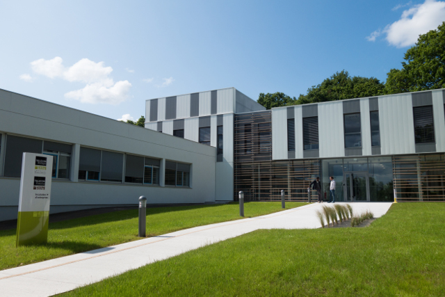

À propos
########

:slug: a-propos
:lang: fr
:url: a-propos
:save_as: index.html

Cette année la PyCon-FR 2016 a lieu à Rennes sur le campus de Beaulieu
dans les locaux de Télécom Bretagne du 13 au 16 octobre 2016.

`Télécom Bretagne <http://www.telecom-bretagne.eu/ecole/campus_de_rennes/>`_
2, rue de la Châtaigneraie
35576 Cesson Sévigné

**Coordonnées GPS :** 48.1206 - 01.6278

Qu'est-ce que PyCon-fr ?
========================

PyCon-fr c'est **le rassemblement annuel de la communauté Python
francophone**.

Organisée chaque année depuis 10 ans par `l'AFPy`_ cette conférence
est gratuite, entièrement organisée par des bénévoles et regroupe
professionnels, chercheurs, étudiants et amateurs autour d'une même
passion pour le langage de programmation Python_.

.. _`l'AFPy`: http://www.afpy.org/
.. _Python: http://www.python.org/

L'édition 2016 aura lieu à Rennes en octobre
============================================

PyCon-fr se déroulera cette année sur 4 jours à Rennes sur le campus
de Beaulieu dans les locaux de Télécom Bretagne :

- deux jours de sprints les 13 et 14 octobre
- deux jours de conférences les 15 et 16 octobre

Conférences et Ateliers
=======================

Durant ces deux jours, vous aurez l'occasion de participer à des
présentations sur des sujets variés, autour du langage Python, de ses
usages, des bonnes pratiques, des retours d'expériences, des partages
d'idées…

Les deux premiers jours sont reservés à des sprints :

Les développeurs de différents projets open-source se rejoignent
pour coder ensemble. Tout le monde est le bienvenu pour contribuer et les nouveaux aussi.

Participez au développement de votre projet préféré ! Nous fournissons
l'espace et le matériel nécessaire à l'organisation (tables, chaises,
connexion internet… et café !)

Si vous souhaitez organiser un sprint, contactez nous et nous
ajouterons votre projet au programme des sprints.

Informations complémentaires
============================

Vous trouverez sur ce site toutes les informations relatives à
l'organisation de votre venue, des sprints et des conférences.

- **Email pour l'évènement :** `contact@pycon.fr <contact@pycon.fr>`_
