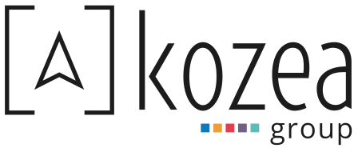

Nos soutiens
############

:slug: soutiens
:lang: fr
:url: soutiens

Partenaires
===========

`Kozea <https://www.kozea.fr/>`_
--------------------------------

Kozea a conçu et intégré le design du site web de PyConFr 2018 et les éléments graphiques imprimés (tshirts, affiches, etc...).

Platine
=======

`Devenez le premier partenaire "Platine" </pages/nous-soutenir.html>`_

Or
==

`Devenez le premier partenaire "Or" </pages/nous-soutenir.html>`_

Argent
======

`Devenez le premier partenaire "Argent" </pages/nous-soutenir.html>`_

Bronze
======

`Devenez le premier partenaire "Bronze" </pages/nous-soutenir.html>`_

Cœur
====

`Devenez le premier partenaire "Cœur" </pages/nous-soutenir.html>`_
