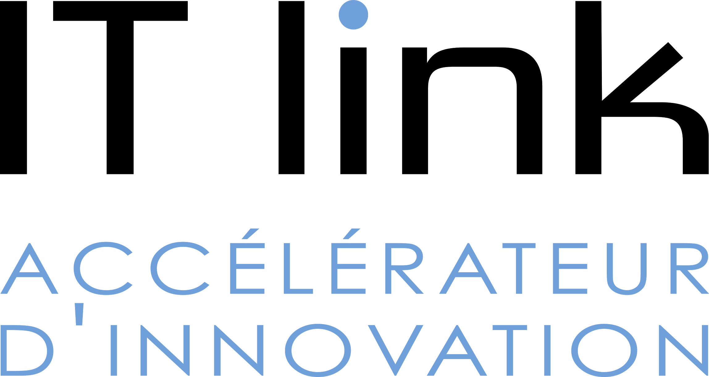
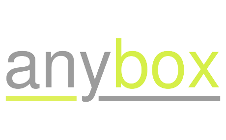
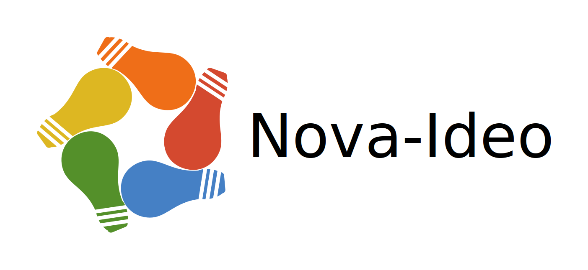
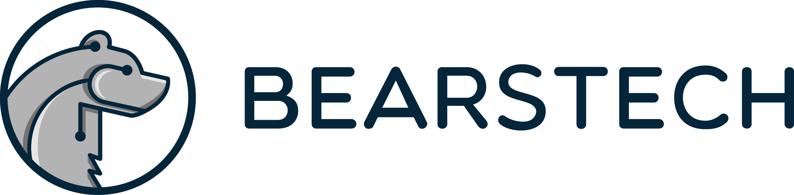

Nos soutiens
############

:slug: soutiens
:lang: fr
:url: soutiens

Partenaires
===========

Platine
=======

`Netsach <http://netsach.com/>`_
--------------------------------

API Bridging & Automation

Société spécialisée dans la conception de plateforme digitales

Solutions d'interconnexion et d'automatisation pour les services numériques

`Devenez partenaire "Platine" </pages/nous-soutenir.html>`_

Or
==

`Logilab <https://www.logilab.fr/>`_
------------------------------------

.. image:: ../images/logo_logilab.png
    :height: 100px
    :alt: logo de Logilab
    :target: https://www.logilab.fr/

Depuis l'an 2000, nous développons avec agilité des logiciels libres
innovants pour le web et les sciences, et accroissons nos
connaissances via la R&D pour les partager lors de formations.

Pionniers de Python et du Web en France et en Europe, nous formons
chaque année plusieurs centaines d'ingénieurs, de scientifiques et
d'utilisateurs souhaitant développer des logiciels et exploiter leur
données.

`IT Link <https://www.itlink.fr/>`_
-----------------------------------

IT Link, le spécialiste du digital industriel, conçoit pour ses clients des systèmes connectés, pour qu’ils tirent tout le bénéfice du numérique comme levier de croissance et de compétitivité. Présente dans une dizaine de régions françaises ainsi qu’à Bruxelles, l’entreprise poursuit son développement en Europe et outre-Atlantique

Aéronautique, Transports, Energie, Services …: les clients d’IT Link lui confient des projets à forte valeur ajoutée pour créer leur business de demain. IT Link mobilise pour eux l’ensemble des expertises pour concevoir toutes les briques d’un système connecté, des capteurs au Système d’Information.

Conscient de la forte valeur ajoutée du langage Python, et ses atouts indéniables (multiplateformes, natif Linux/Mac, communauté importante et active, ...), IT Link a développé un pôle de compétences autour de ce langage. 

IT Link, propose ainsi à ses clients, et ce dans le respect des bonnes pratiques Python, d'assumer l'ensemble du développement de leur projets, du pilotage de périphériques (capteurs, moteurs, ...) à la restitution de données, en clients lourds ou léger, en système embarqué ou non. IT Link leur propose également des formations dans ce langage.

Cette activité à forte croissance amène IT Link à recruter de plus en plus de Pythonistes et fait d'IT Link, plus que jamais, le partenaire privilégié de vos projets.

Une question? A la recherche d'un emploi (besoin Python en cours) ? N'hésitez pas à nous contacter.

`Makina Corpus <https://makina-corpus.com/>`_
---------------------------------------------

Makina Corpus conçoit et développe des solutions web et mobiles innovantes, en s'appuyant exclusivement sur des logiciels libres.

La société s'est spécialisée dans le développement d'applications métiers, de portails complexes et de cartographies dynamiques.

`People Doc <http://www.people-doc.fr/>`_
-----------------------------------------

.. image:: ../images/logo_people_doc.png
    :height: 100px
    :alt: logo de People Doc
    :target: http://www.people-doc.fr/

Peopledoc, plateforme SaaS de digitalisation RH aide les entreprises à simplifier et fluidifier les processus administratifs entre RH et salariés. Sa mission : répondre plus vite et plus efficacement aux demandes des collaborateurs et managers, automatiser les processus RH de l’onboarding à l’off-boarding tout en garantissant une pleine conformité réglementaire, en France comme à l’étranger. Comptant plus de 500 clients dans 165 pays et neufs langues opérées, nous recrutons des développeurs expérimentés en Python / Django afin de faire face à tous les challenges R&D associés. Nos applications tournent surtout grâce à Python et Django, mais aussi Postgresql, ElasticSearch, RabbitMQ, Java, Scala, Emberjs, Ansible...

- Découvrir PeopleDoc : www.people-doc.fr
- Postuler : www.people-doc.fr/carrieres
- PeopleDoc en vidéo : http://bit.ly/2sxkIg2

`Devenez partenaire "Or" </pages/nous-soutenir.html>`_

Bronze
======

`Anybox <https://anybox.fr/>`_
------------------------------

ERP, applications métiers, infrastructure, maintenance.

`Ecreall <http://www.ecreall.com>`_
-----------------------------------

Ecréall est éditeur de la solution d'innovation participative agile Nova-Ideo qui permet :

- de recueillir les idées et questions d'un collectif,
- d'organiser des fils de discussions et des challenges,
- de co-écrire itérativement des propositions applicables,
- de recueillir les soutiens ou rejets des membres,
- enfin de diffuser les avis des comités.

`Bearstech <https://bearstech.com/>`_
-------------------------------------

Bearstech est une société coopérative d’ingénieurs spécialisée en infogérance, hébergement, conseil et audit. Parmi nos missions, nous vous accompagnons dans votre démarche DevOps ou la migration de votre infrastructure vers le Cloud. Nous assurons le suivi de l’exploitation de vos plates-formes dans le cloud ou sur serveurs dédiés. Nous maintenons des infrastructures robustes et performantes pour vos projets les plus critiques nécessitant la plus grande qualité de service.

`Yaal <https://www.yaal.fr/>`_
------------------------------

Yaal s'adresse aux créateurs d'entreprises à forte composante
numérique qui cherchent une équipe technique expérimentée, réactive et
engagée.

Nous nous engageons à leurs côtés en apportant notre expérience de la
création d’entreprise, en partageant le risque financier et en prenant
en charge la direction technique pour faire de leur idée un projet
unique et durable.

`Devenez partenaire "Bronze" </pages/nous-soutenir.html>`_

Cœur
====

`Devenez l·e·a premi·er·ère partenaire "Cœur" </pages/nous-soutenir.html>`_
